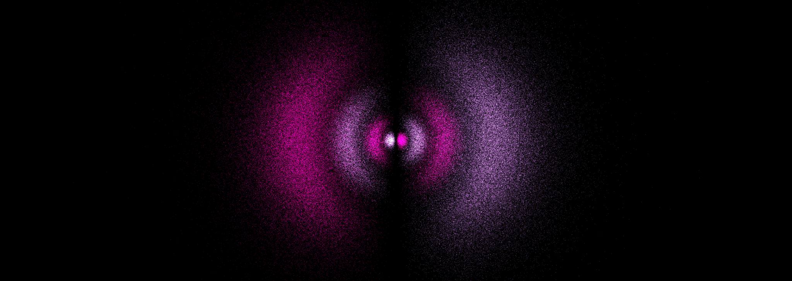
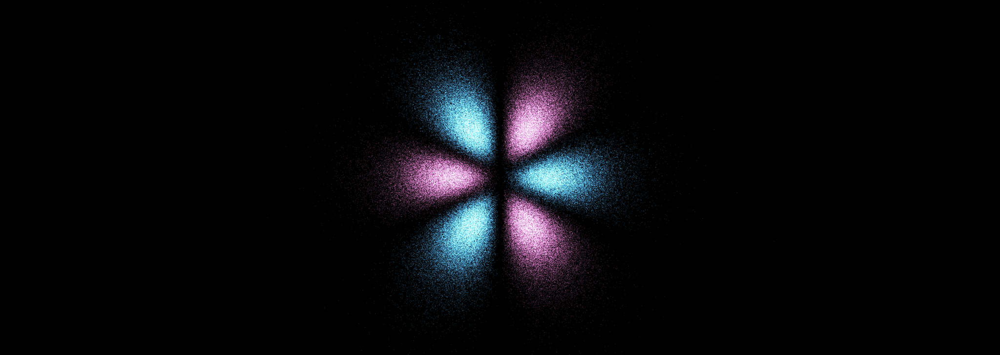
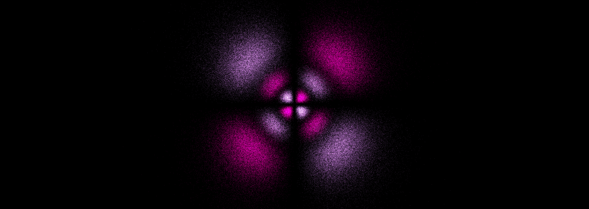
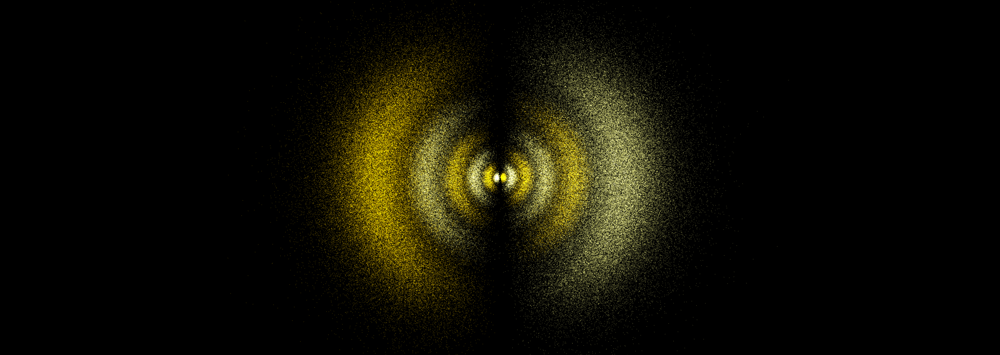
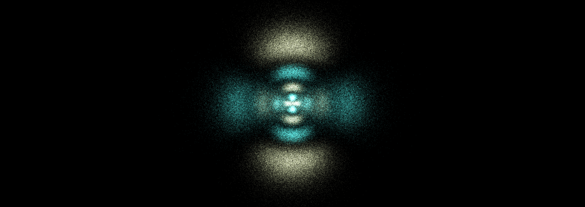
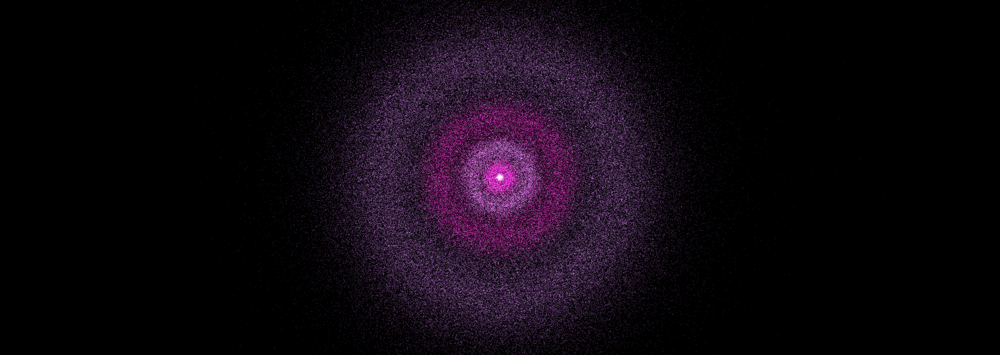

# Atomic Orbital Renderer
Render beautiful looking atomic orbitals using the **Schrodinger Wave Function**.

This is a project I would've loved to make on the GPU. However the complexity quickly went over my head. Perhaps in the future.
```css
Made with TypeScript, React.js, THREE.js, and Tailwind.css
```



## Math
<!-- Before explaining the renderer, I'll explain the math: -->

**Wave Function:** Comprised of a Radial component (magnitude) and Angular component (direction).

**Zeff:** Calculated for each shell. Represents how heavily shielded the nucleus is by other electrons. Gives highly accurate results compared to simply using Z number. Essential for rendering larger atoms.

**Radial component:** Takes n, l, Z, and r as inputs. Uses Laguirre polynomials to get magnitude. Distance from nucleus.
```typescript
function radialWF(n: number, l: number, Z: number, r: number): number {
    const rho = (2 * Z * r) / n;
    return Math.exp(-rho / 2) * Math.pow(rho, l) * assocLaguerre(n - l - 1, 2 * l + 1, rho);
}
```
**Angular component:** Takes l, m, cosine, sine, and phi (azimuthal angle) as inputs. Uses Legendre polynomials along with some clever to get direction. Models the shape of the orbital.
```typescript
function realSH(l: number, m: number, cosT: number, sinT: number, phi: number): number {
    const absM = Math.abs(m);
    const N = Math.sqrt(
        ((2 * l + 1) / (4 * Math.PI)) *
        (factorial(l - absM) / factorial(l + absM))
    );
    const Plm = assocLegendre(l, absM, cosT, sinT);
    if (m === 0) return N * Plm;
    const K = Math.SQRT2 * N * Plm;
    return m > 0 ? K * Math.cos(absM * phi) : K * Math.sin(absM * phi);
}
```
## Renderer
The first step is generating the layers based on Z number. We add S, P, D, and F orbitals in order, until we run out of electrons.
Calculate the shielding constant (Z_eff) for each shell. Place electrons spin-up first, then spin-down.

Once all orbitals are filled, we have to "prime" our Monte Carlo system.
[radial bin explanation]
[rejection ceiling explanation]

<!-- Next, we sample a small number of points (600) to find the rejection ceiling. -->
<br>

The next step is evaluating lots of random spherical coordinates. For each point, we have to evaluate the Laguirre and Legendre polynomials (n, l, Zeff, r).
These are combined to form the wave function Psi. Squaring this gives you the probability distribution Rho.

If the sample exceeds our angular bounds (rejection ceiling), we continue.
This process can repeat ~50 times per point. Once it succeeds, the point is plotted. Otherwise, it's discarded.

This process is repeated for each electron shell. All position[] and color[] arrays are converted into a THREE.Points material for easy rendering.

<br>

Using random spherical sampling instead of an n^3 grid of cartesian coordinates was my biggest breakthrough.
Instead of plotted points being equally spread out, the density increases near the nucleus and decreases outward. Beautiful.
Using an n^3 approach was my first instinct as a CS student, but it was the wrong tool for the job.

**Before and after:**


To those asking: Did you really learn quantum mechanics for this project? The answer is just a little. I'm not super knowledgable about quantum mechanics (yet). As someone who plots equations however, this was an excellent challenge.

## Setup
For the quickest setup, use the <Viewer/> component from Viewer.tsx
Here is an example:

```html
import { Viewer } from "./Viewer";
<html>
  <body>
    <Viewer/>
  </body>
</html>
```

For custom pages, use the <Schrodinger/> component from Schrodinger.tsx.
Here is an example:
```html
<Schrodinger
  layers={currentLayers}
  version={version}
  visualScale={visualScale}
  renderMode={renderMode} />
```

## Gallery








